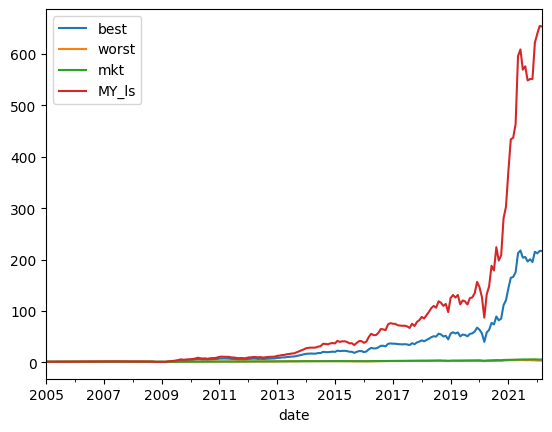
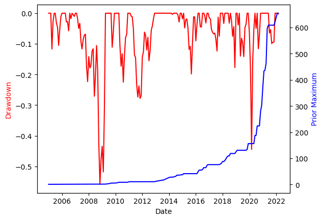
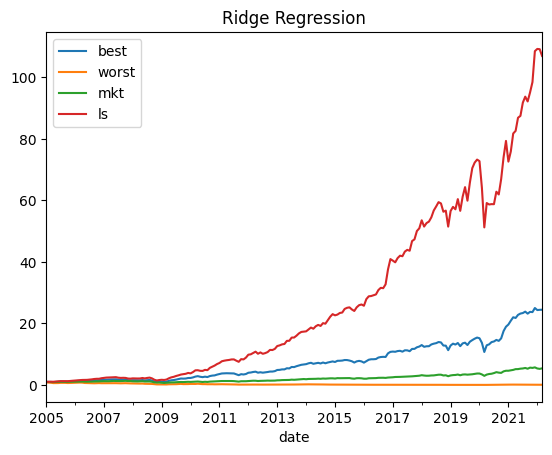
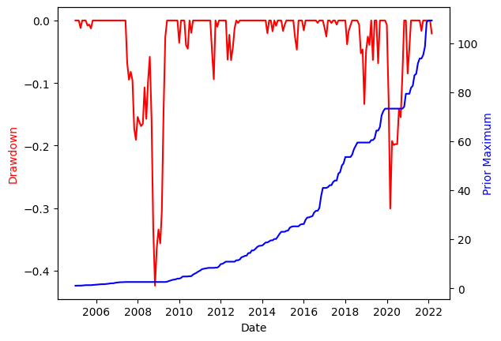

# Discussion for Stock Picking Strategy
## Factors to consider when picking stocks:

 - High volatility: Stocks with high levels of volatility can experience significant price movements in a short period of time. However, this can also result in significant losses if the stock price moves in the opposite direction.
 - High beta: Beta is a measure of a stock's sensitivity to market movements. Stocks with high betas are typically more volatile and can potentially generate higher returns, but also come with higher levels of risk.
 -  Low liquidity: Stocks with low trading volumes can be illiquid, meaning that they may be difficult to sell or buy, particularly during periods of market stress. While these stocks may potentially offer higher returns, they come with higher levels of liquidity risk.
 - High debt levels: Companies with high levels of debt may face higher interest payments, which can impact their profitability and financial health. These stocks may be considered high-risk due to their potentially vulnerable financial position.
 - High valuation: Stocks with high price-to-earnings ratios or other valuation metrics may be considered high-risk, as they may be overvalued relative to their earnings or other fundamentals.

Choosing the number of stocks to include in a portfolio and how to distribute funds among them depends on a variety of factors, such as investment objectives, risk tolerance, and the size of the portfolio. Here are some general guidelines to be considered:

Diversification: Investing in a diversified portfolio can help reduce risk by spreading your investments across different companies and sectors. Typically, a portfolio of 20-30 stocks is considered well-diversified. However, the number of stocks may vary depending on the investor's preference and the size of the portfolio.
Investment Objective: The number of stocks included in a portfolio can also depend on the investment objective. For example, if the objective is to invest in high-growth companies, the portfolio may include a smaller number of stocks than if the objective is to generate income through dividend-paying stocks.
Risk Tolerance: Investors with a higher risk tolerance may be comfortable with a larger number of stocks in their portfolio. On the other hand, investors with a lower risk tolerance may prefer a smaller number of stocks.

When it comes to distributing funds among stocks in a portfolio, one common approach is to allocate a percentage of the total funds to each stock based on its weight in the portfolio. This is known as "equal-weighted" allocation. Another approach is "market-capitalization-weighted" allocation, where the percentage of funds allocated to each stock is based on its market capitalization (i.e., the total value of its outstanding shares).

Ultimately, the distribution of funds among stocks in a portfolio will depend on the investor's investment objectives, risk tolerance, and the size of the portfolio. It's important to carefully consider each stock's fundamentals, such as earnings, revenue, and valuation, before deciding how much to allocate to each one. Additionally, it's important to periodically review and rebalance the portfolio to ensure that it remains aligned with the investor's investment objectives and risk tolerance.

XGBoost is a popular machine learning model for predicting stock prices and making investment decisions. Here's an example of how you could use XGBoost to choose and weight stocks in a portfolio:

 - Data Collection: Collect financial data on a set of stocks, including metrics such as price-to-earnings ratio, price-to-book ratio, dividend yield, and revenue growth. You could use a financial data API or scrape data from financial websites to collect this data.
 - Data Preprocessing: Clean and preprocess the data by removing missing values, scaling the data, and encoding categorical variables.
 - Feature Selection: Use XGBoost's built-in feature importance scores to identify the most important features for predicting stock performance.
 - Train the Model: Train an XGBoost model on the historical data to predict future stock prices based on the selected features.
 - Portfolio Selection: Use the XGBoost model to rank the stocks in your dataset based on their predicted future performance. Select the top-performing stocks to include in your portfolio.
 - Portfolio Weighting: Assign weights to the selected stocks based on their predicted future performance. For example, you could assign a higher weight to stocks with a higher predicted return and a lower weight to stocks with a lower predicted return.
 - Portfolio Evaluation: Evaluate the performance of your portfolio over time using metrics such as Sharpe ratio, total return, and maximum drawdown. Periodically retrain and update the XGBoost model to ensure it remains accurate and effective.

It's important to note that this is just one example of how you could use XGBoost to choose and weight stocks in a portfolio. The specific implementation will depend on the data available, the investment objectives, and the risk tolerance of the investor. Additionally, it's important to carefully evaluate the quality of the data used to train the model and to consider other forms of analysis in addition to machine learning.

# **Strategy 1: XGBoost**

## Returns

## Drawdown

# **Strategy 1: Ridge Regression**

## Returns

## Drawdown

